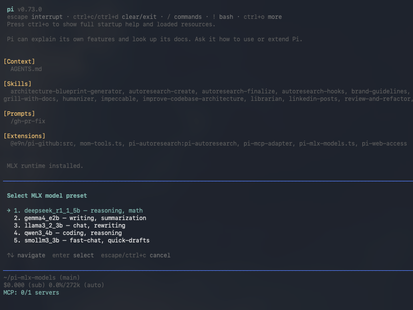
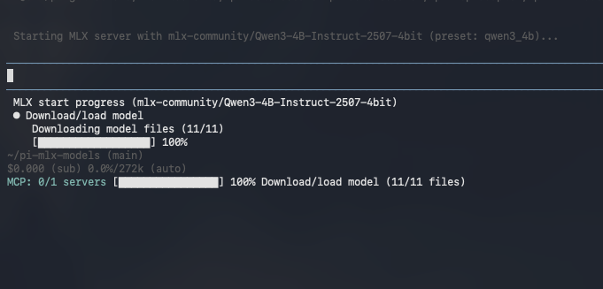
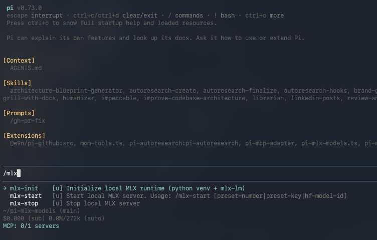
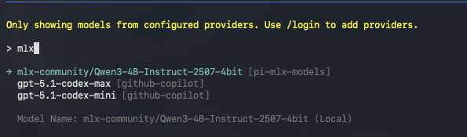

# pi-mlx-models

Local MLX model launcher for [Pi](https://pi.dev) on Apple Silicon.

<p align="center">
  
</p>

`pi-mlx-models` adds a local OpenAI-compatible provider to Pi, with a guided startup flow for MLX models.

## What you get

- Interactive preset selector via `/mlx-start`
- Local runtime bootstrap via `/mlx-init` (venv + `mlx-lm`)
- Startup progress with stage/status updates and warm-up timer
- Provider models only appear when the server is actually ready
- Stop/cleanup command via `/mlx-stop`

## Install

### From npm

```bash
pi install npm:pi-mlx-models
```

### From GitHub

```bash
pi install git:github.com/vmarinogg/pi-mlx-models
```

## Quick start

```bash
/mlx-init
/mlx-start
```

When `/mlx-start` is used with no args, a selector opens and you can pick a preset with arrow keys + Enter.

You can also start directly with a full model id:

```bash
/mlx-start mlx-community/Qwen3-4B-Instruct-2507-4bit
```

## Commands

- `/mlx-init` — initialize local MLX runtime
- `/mlx-start [hf-model-id]` — open selector (no args) or start with full model id
- `/mlx-stop` — stop server and clear active provider models

## Included presets

- `deepseek_r1_1_5b` — reasoning, math
- `gemma4_e2b` — writing, summarization
- `llama3_2_3b` — chat, rewriting
- `qwen3_4b` — coding, reasoning
- `smollm3_3b` — fast chat, quick drafts

> [!TIP]
> Want to try other models? Browse MLX Community collections on Hugging Face:  
> https://huggingface.co/mlx-community/collections

## Requirements

- macOS on Apple Silicon
- Python 3.10–3.13

## Configuration

Environment variables supported by the extension:

- `PI_MLX_MODELS_PORT` (default: `11434`)
- `PI_MLX_MODELS_HOST` (default: `127.0.0.1`)
- `PI_MLX_MODELS_BASE_URL` (default: `http://<host>:<port>/v1`)
- `PI_MLX_MODELS_DEFAULT_MODEL` (default: `mlx-community/Qwen3-4B-Instruct-2507-4bit`)

## Local data paths

Runtime artifacts are stored under:

- `~/.pi/agent/pi-mlx-models/venv`
- `~/.pi/agent/pi-mlx-models/models`

## Development

```bash
npm install
npm run build
```

Pi package manifest is in `package.json`:

- `pi.extensions: ["dist/index.js"]`

## Screenshots

### Startup progress



### Command menu



### Model selection


